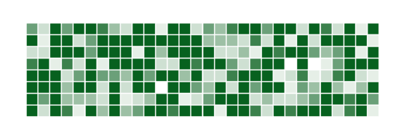

# react-native-heatmap

A Components of heatmap for react-native ios and android

## Installation

```sh
npm install @ncuhomeclub/react-native-heatmap
```

## Usage

使用例子


```jsx
import HeatMap from '@ncuhomeclub/react-native-heatmap';

function App() {
  const data = [
    [1, 23, 0],
    [2, 10, 65],
    [20, 50, 43],
  ];
  return (
    <View style={styles.container}>
      <HeatMap data={data} xNumber={2} yNumber={3} />
    </View>
  );
}

const styles = StyleSheet.create({
  container: {
    flex: 1,
    alignItems: 'center',
    justifyContent: 'center',
  },
  box: {
    width: 60,
    height: 60,
    marginVertical: 20,
  },
});
```

## Contributing

See the [contributing guide](CONTRIBUTING.md) to learn how to contribute to the repository and the development workflow.

## License

MIT

---

Made with [create-react-native-library](https://github.com/callstack/react-native-builder-bob)
